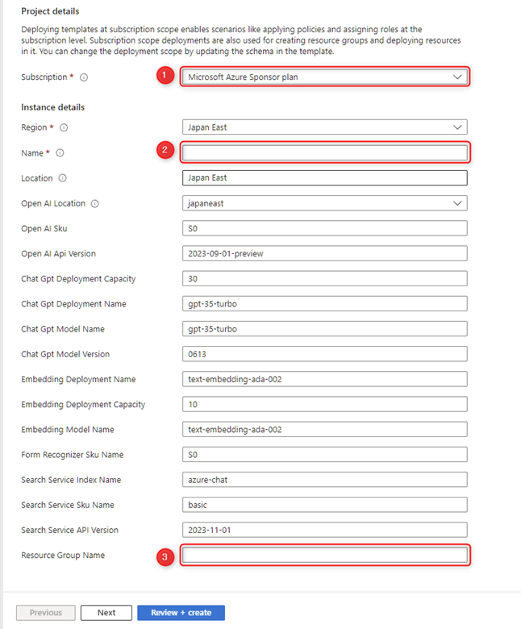
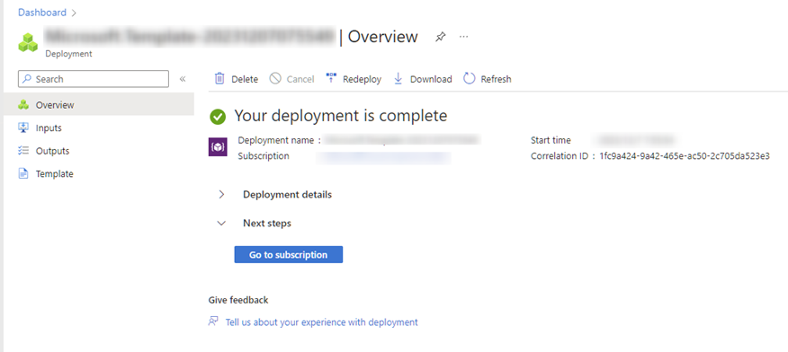
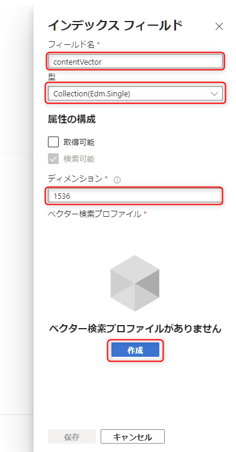

# 🧪 S2. Azure のリソースをセットアップ

ここでは、以下のステップで Azure のリソースをセットアップします。

- ARM テンプレートを使ってリソース作成
- Azure AI Search: インデックスの作成

## 🔖 ARM テンプレートからリソース作成

以下の `Deploy to Azure` のボタンをクリックすることで、Azure ポータルに遷移して以下のリソースを作成するための画面が開きます。

- Azure OpenAI Sservice
- Azure AI Search
- Azure Cosmos DB
- Azure App Service および App Service Plan
- Key Vault
- Document intelligence

> ※ いくつかのリソースは今回のハンズオンで直接使用しませんが、azurechat との依存があるために生成します。詳細をご確認したい場合は以下のリンクをご参照ください。
>
> - [microsoft/azurechat: Azure Chat Solution Accelerator powered by Azure Open AI Service](https://github.com/microsoft/azurechat)

📝 Azure ポータルでの操作は具体的な操作はトレーナーが説明します。

 

Azure ポータルで以下の画面が表示されます。以下表を参考に入力して、"Review + create" をクリックします。

No. | パラメーター名 | 値
--- | --- | ---
1 | Subscription | ご利用の Azure サブスクリプション
2 | Name | 任意のコードネームを入力
3 | Resource group Name | 任意のリソースグループ名

 

"Review + create" をクリックすると、確認画面が表示されます。"Create" をクリックしてリソースの作成を開始します。

リソースの作成には数分かかります。リソースの作成が完了すると、以下の画面が表示されます。

 

## 🔖 AI Search: インデックスの作成

今回の利用するデータは、Azure のサービスの説明文です。このデータを検索するために必要な検索インデックスのスキーマを定義します。

まず、Auzre portal で AI Search のリソースを表示し、概要の上部にある "インデックスの追加" > "インデックスの追加" をクリックします。

 

インデックスの作成画面が表示されます。インデックス名に「azure」と入力します。

 

次に "フィールドの追加" をクリックしてフィールドを追加します。以下図を参考に3つのフィールドを追加します。

フィールド名 | 型 | 取得可能 | フィルター可能 | ソート可能 | ファセット可能 | 検索可能 | アナライザー
--- | --- | :---: | :---: | :---: | :---: | :---: | ---
title | Edm.String | ✅ | - | - | - | ✅ | 日本語 - Microsoft
category | Edm.String | ✅ | ✅ | - | ✅ | ✅ | 日本語 - Microsoft
content | Edm.String | ✅ | - | - | - | ✅ | 日本語 - Microsoft

 

最後に、ベクターの値を格納するためのフィールドを追加します。入力は以下図を参考に、「フィールド名」「型」「ディメンション」を入力します。  
入力後「ベクター検索プロファイルがありません」の表記の下にある "作成" をクリックします。

 

ベクタープロファイルの作成画面が表示されます。今回は、下部にある **"ベクター化"は不要なので作成しません。**  
上部にある**アルゴリズムの構成** の "作成" をクリックします。

以下図の画面が表示されますのでデフォルトの値のままで "保存" をクリックします。

> ※ この値に関してご興味がありましたら、以下のドキュメントをご参照ください。
>
> - [ベクター検索の概念 | Microsoft Learn](https://learn.microsoft.com/ja-jp/azure/search/vector-search-overview#why-use-vector-search)

ベクタープロファイルの画面が表示されます。ベクター化なしのままで、"保存" をクリックします。

インデックスフィールドの画面に戻るので、もう一度 "保存" をクリックします。これでこのフィールドの追加が完了です。

 

最終的に以下のようなインデックスを構成したことを確認して左下の "作成" をクリックします。

 

## 📚 参考情報

### Azure AI Search

- [Azure AI Search の概要 | Microsoft Learn](https://learn.microsoft.com/ja-jp/azure/search/search-what-is-azure-search)
- [Azure AI Search のインデックス | Microsoft Learn](https://learn.microsoft.com/ja-jp/azure/search/search-what-is-an-index)

 

## ⏭️ NEXT STEP ✨

おめでとうございます🎉。ワークショップで利用するすべての Azure のリソースの準備が完了しました。次はコードの実装に進みます。

[📋 目次](../README.md) | [⏭️ 次へ](./setup-function-app-code.md)
