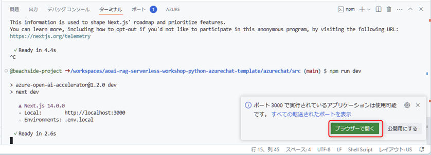
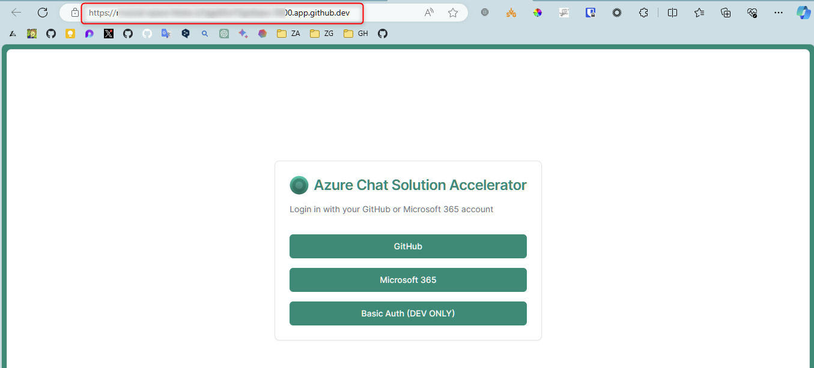
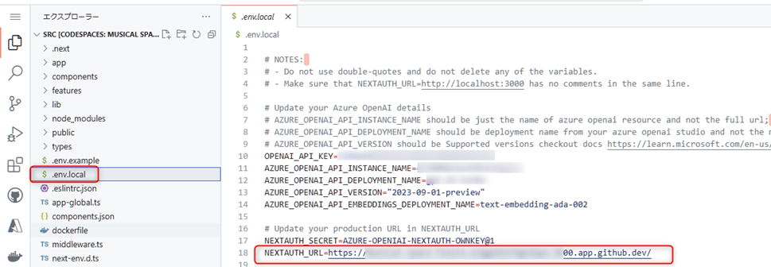
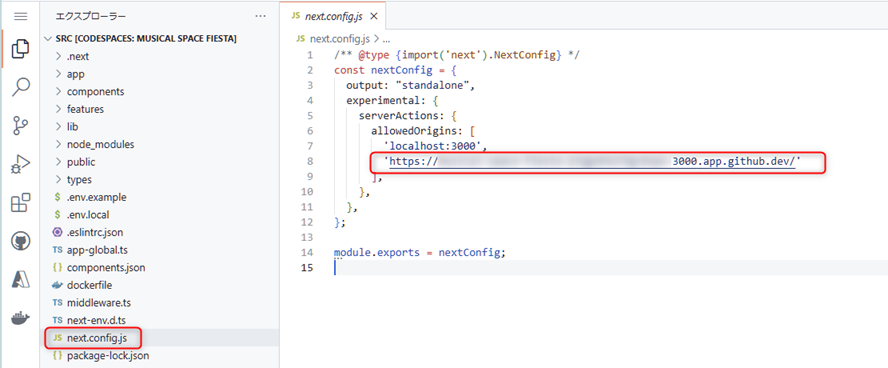
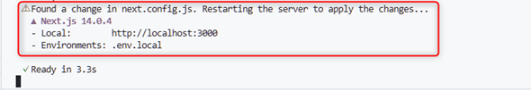
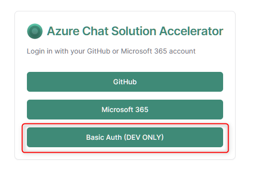
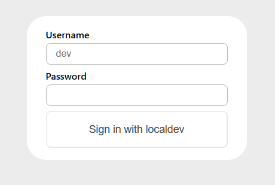
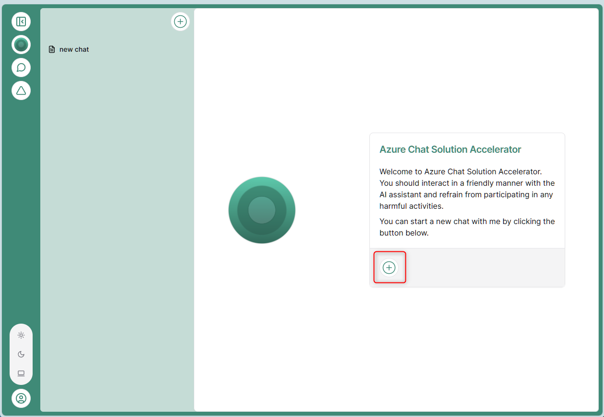
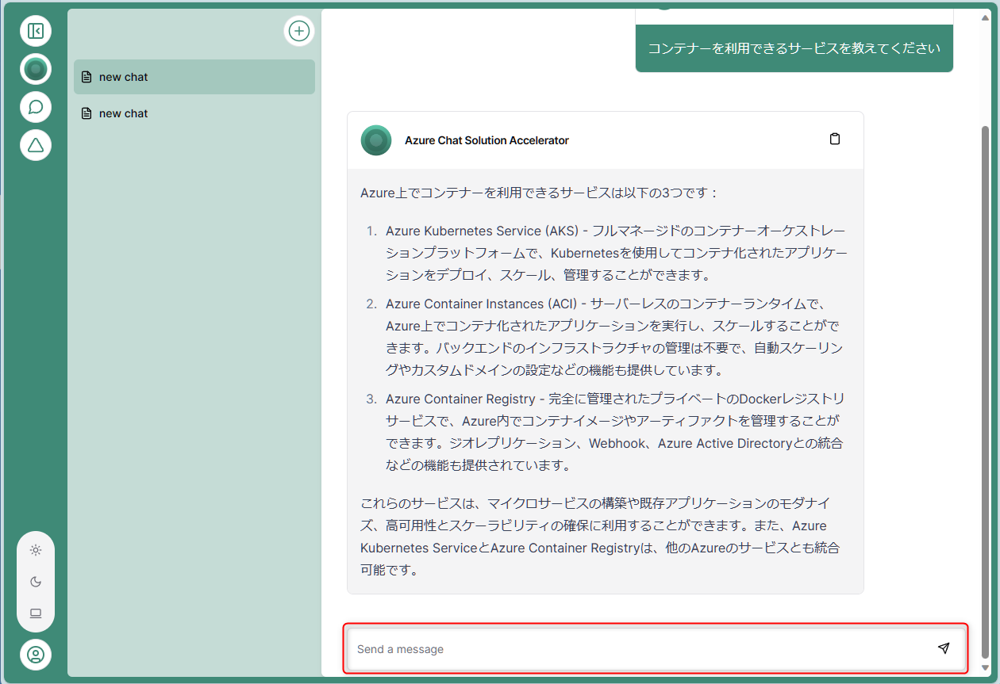

# 🧪 Azure Chat でチャットの動作を試す

ここでは、Azure Chat 用の Codespaces を起動し、ローカルで Azure Chat をデバッグしてチャットの動作を試します。

ここで実行する Azure Chat は、マイクロソフトが GitHub で OSS として公開しているチャットボットのプログラムを、このハンズオン用にカスタマイズしたプログラムです。  
Azure Chat に関する説明は時間の都合上割愛しますが、以下のリンクを参照してください。

- [azurechat - GitHub](https://github.com/microsoft/azurechat)

## 🔖 Codespaces の起動

ハンズオン用にセットアップされた **Dev container configuration: "Azure Chat"** を指定して Codespace を起動します。

> 📝 具体的な操作方法はトレーナーが解説します。

## 🔖 環境変数のセットアップ

Codespace を起動すると src がルートとして開きます。

`.env.example` を元に `.env.local` ファイルを作成し、Cosmos DB / Azure AI Search / Azure OpenAI Service の情報をセットアップします。

> 📝 具体的な操作方法はトレーナーが解説します。


## デバッグ実行

ターミナルを起動して以下のコマンドを実行します。

```cmd
npm install
```

次に以下のコマンドを実行して、ローカルで Azure Chat を起動します。

```cmd
npm run dev
```

正常に起動すると、以下のように表示されます。`ブラウザ―で開く` をクリックして、ブラウザで Azure Chat を開きます。



<br>

ローカル起動だとややもっさりしていますが、以下の画面が表示されるまでお待ちください。表示されたら、URL の値をコピーします。



<br>

コピーした URL の値を2つの場所に貼り付けます。

1つ目です。Codespace で **env.local** を開き、`NEXTAUTH_URL` の値をコピーした URL に変更します。



<br>

2つ目です。Codespace で **next.config.js** を開き、8行目に URL の値をペーストします。値は、シングルクォートで囲みます。




<br>

ターミナルで更新されたことを確認します。



<br>

これで Azure Chat を動作させる設定が完了しました。Azure Chat のタブに戻り、"Basic Auth (DEV ONLY) をクリックします。



<br>

ログイン画面が表示されます。パスワードに適当な文字を入力してログインします (何を入力してもログインできるようになっています)。



<br>

以下の画面が表示されますので "+" をクリックします。初回起動時はもっさりしていますが数秒待つと、チャットの画面が表示されます。



<br>

下部の "Send a message" に Azure に関する質問をしてみましょう。Azure Chat は、ハンズオンで更新した AI Search のインデックスを元に回答を返します。  
参考までに質問の例は以下の通りです。

- 「セキュリティ関連のサービスは何がありますか」
- 「コンテナーを利用できるサービスを教えて」
- 「ウェブサイトをホストするサービスは何がありますか」



<br>


## 🎉 Congratulations 🎉

おめでとうございます。これですべてのハンズオンが完了しました。

最後に、ハンズオンで作成した Azure のリソースを一括で削除する手順を紹介します。

---

[⏮️ 前へ](./implement-data-ingestor.md) | [📋 目次](../README.md) | [⏭️ 次へ: Azure のリソース削除](./remove-azure-resources.md)
